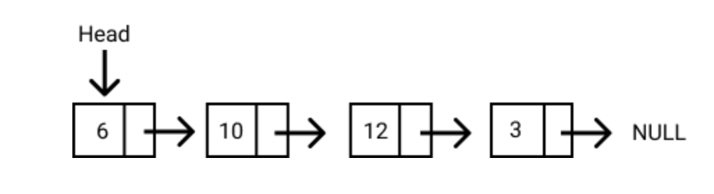

## What is a Linked List?
- A linked list is a linear data structure similar to an array. However, unlike arrays, elements are not stored in a particular memory location or index. Rather each element is a separate object that contains a pointer or a link to the next object in that list. 

Each element (commonly called nodes) contains two items: the data stored and a link to the next node. The data can be any valid data type



The entry point to a linked list is called the head. The head is a reference to the first node in the linked list. The last node on the list points to null. If a list is empty, the head is a null reference. 

## Types of Linked Lists

There are three types of linked lists:

- **Singly Linked Lists**: Each node contains only one pointer to the next node. This is what we have been talking about so far.
- **Doubly Linked Lists**: Each node contains two pointers, a pointer to the next node and a pointer to the previous node.
- **Circular Linked Lists**: Circular linked lists are a variation of a linked list in which the last node points to the first node or any other node before it, thereby forming a loop.

### In JavaScript, a linked list looks like this:

```js
const list = {
    head: {
        value: 6
        next: {
            value: 10                                             
            next: {
                value: 12
                next: {
                    value: 3
                    next: null    
                    }
                }
            }
        }
    }
};
```

## An advantage of Linked Lists
- Nodes can easily be removed or added from a linked list without reorganizing the entire data structure. This is one advantage it has over arrays.

## Disadvantages of Linked Lists
- Search operations are slow in linked lists. Unlike arrays, random access of data elements is not allowed. Nodes are accessed sequentially starting from the first node.
- It uses more memory than arrays because of the storage of the pointers.

## Implementing a List Node in JavaScript

As stated earlier, a list node contains two items: the data and the pointer to the next node. We can implement a list node in JavaScript as follows:

```js
class ListNode {
    constructor(data) {
        this.data = data
        this.next = null                
    }
}
```

## Implementing a Linked List in JavaScript

The code below shows the implementation of a linked list class with a constructor. Notice that if the head node is not passed, the head is initialised to null.

```js
class LinkedList {
    constructor(head = null) {
        this.head = head
    }
}
```

## Putting it all together

Let's create a linked list with the class we just created. First, we create two list nodes, `node1` and `node2` and a pointer from node 1 to node 2.

```js
let node1 = new ListNode(2)
let node2 = new ListNode(5)
node1.next = node2
```

Next, we'll create a Linked list with the `node1`.

```js
let list = new LinkedList(node1)
```

Let's try to access the nodes in the list we just created.

```js
console.log(list.head.next.data) //returns 5
```

## Some LinkedList methods

Next up, we will implement four helper methods for the linked list. They are:

1. size()
2. clear()
3. getLast()
4. getFirst()

### 1. size()

This method returns the number of nodes present in the linked list.

```js
size() {
    let count = 0; 
    let node = this.head;
    while (node) {
        count++;
        node = node.next
    }
    return count;
}
```

### 2. clear()

This method empties out the list.

```js
clear() {
    this.head = null;
}
```

### 3. getLast()

This method returns the last node of the linked list.

```js
getLast() {
    let lastNode = this.head;
    if (lastNode) {
        while (lastNode.next) {
            lastNode = lastNode.next
        }
    }
    return lastNode
}
```

### 4. getFirst()

This method returns the first node of the linked list.

```js
getFirst() {
    return this.head;
}
```
